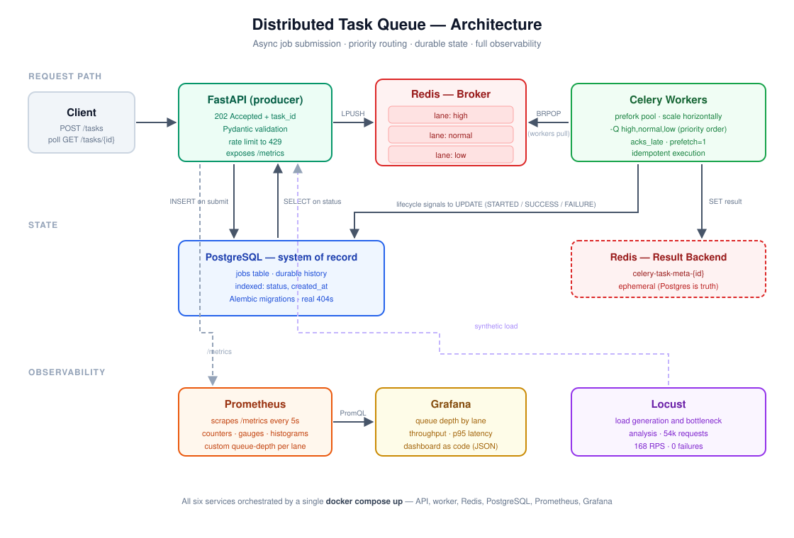
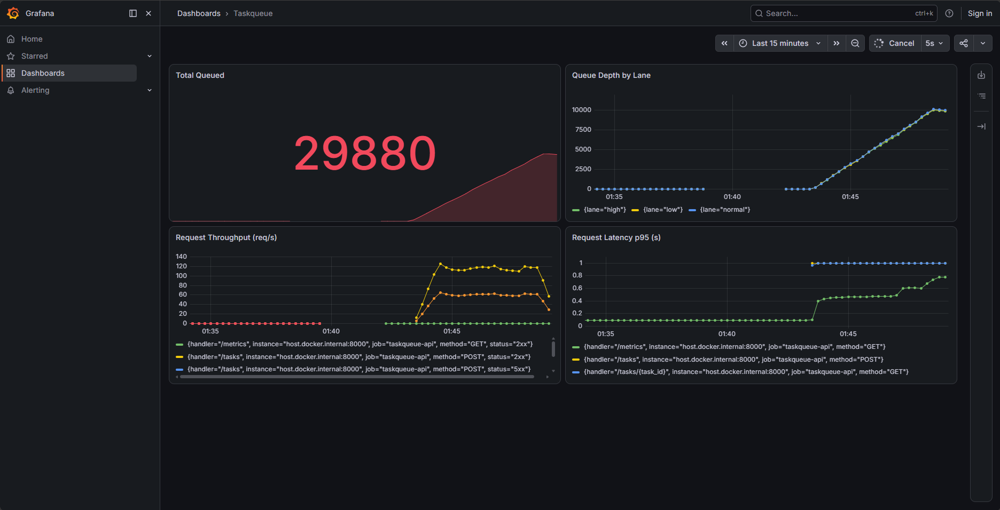
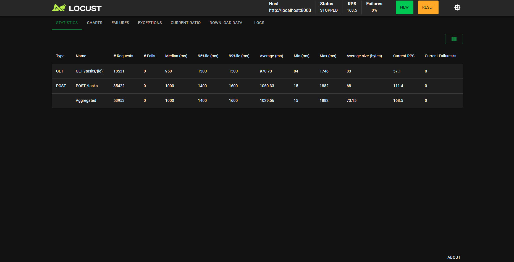

# Distributed Task Queue

A production-shaped async job processing system: submit long-running work over HTTP, get an immediate receipt, and let a pool of workers process it reliably — with priority routing, durable job history, live dashboards, and a documented load-test and security review.

> Built with **FastAPI · Celery · Redis · PostgreSQL · Prometheus · Grafana · Docker Compose**



---

## Why this exists

An HTTP request that triggers slow work (an LLM call, a video encode, a report, a payment) can't hold the connection open — clients time out, proxies cut connections, and one slow job blocks a server worker. The fix is to **decouple accepting work from doing work**: accept the request, return a task ID in milliseconds, and process it elsewhere.

That's what this system is. The interesting part isn't that it queues jobs — it's what happens when things go wrong: workers crash mid-task, clients flood the API, the queue backs up, connections run out. Each of those was deliberately induced, measured, and fixed.

---

## Headline results

| Metric | Result |
|---|---|
| Sustained throughput | **168 RPS** at 200 concurrent users |
| Requests served in final load test | **53,953** with **0 failures** |
| Baseline latency | **p95 150 ms** (light load) |
| Latency under sustained overload | **p95 ~1.4 s, bounded** — degrades gracefully, never errors |
| Bottlenecks found & resolved | **3** (worker saturation → DB pool exhaustion → worker throughput ceiling) |
| Security review | 7 areas audited · 5 fixes applied · dependency scan clean |

---

## Key features

- **Async job submission** — `202 Accepted` + `task_id`, returned in milliseconds; clients poll until a terminal state
- **Priority lanes** — `high` / `normal` / `low` queues drained in priority order, so urgent work never waits behind slow batch jobs
- **Crash-safe delivery** — late acknowledgment + worker-loss rejection means a task survives a `kill -9` mid-execution and gets redelivered
- **Exactly-once *effects*** — idempotency keys make redelivered tasks safe to re-run: delivered twice, executed once
- **Durable job history** — every job persisted to PostgreSQL with full lifecycle timestamps; queryable by status, indexed for the access pattern
- **Honest status API** — unknown task IDs return a real `404`, not a misleading "pending forever"
- **Live observability** — Prometheus metrics (including a custom per-lane queue-depth gauge) visualised in Grafana
- **Rate limited** — per-client throttling returns `429` before a flooding client can bury the workers
- **One-command stack** — six containerized services orchestrated by `docker compose up`

---

## Quick start

**Prerequisites:** Docker & Docker Compose.

```bash
git clone https://github.com/BrijeshDangwal/Taskqueue.git
cd Taskqueue

cp .env.example .env          # defaults work out of the box for local dev

docker compose up -d --build  # builds the app image, starts all six services
docker compose ps             # confirm: api, worker, redis, postgres, prometheus, grafana
```

| Service | URL |
|---|---|
| API + interactive docs | http://localhost:8000/docs |
| Prometheus | http://localhost:9090 |
| Grafana (`admin` / `admin`) | http://localhost:3000 |

**Submit a job and poll for the result:**

```bash
# submit — returns instantly with a task_id
curl -i -X POST http://localhost:8000/tasks \
  -H "Content-Type: application/json" \
  -d '{"seconds": 5, "priority": "high"}'
# → HTTP/1.1 202 Accepted
#   Location: /tasks/<task_id>
#   {"task_id":"<task_id>","status":"queued"}

# poll until terminal (SUCCESS / FAILURE)
curl http://localhost:8000/tasks/<task_id>
# → {"task_id":"...","status":"STARTED","result":null}
# → {"task_id":"...","status":"SUCCESS","result":"slept 5s"}
```

---

## API

| Method | Endpoint | Description |
|---|---|---|
| `GET` | `/health` | Liveness probe |
| `POST` | `/tasks` | Submit a job. Body: `{"seconds": 1-60, "priority": "high\|normal\|low"}`. Returns `202` + `task_id` + `Location` header. Rate limited. |
| `GET` | `/tasks/{task_id}` | Job status and result from PostgreSQL. `404` for IDs never issued. |
| `GET` | `/tasks?status=&limit=` | List jobs, filterable by status. `limit` bounded 1–100. |
| `GET` | `/metrics` | Prometheus exposition endpoint |

---

## Engineering deep-dives

The parts worth reading — each of these was found by breaking the system on purpose.

### 1. Task loss on worker crash → at-least-once delivery

Celery acknowledges tasks **early** by default: the broker deletes the message the moment a worker receives it, *before* the work runs. Killing a worker mid-task with `kill -9` proved the consequence — the task vanished, the queue was empty, and nothing was ever redelivered. Silent data loss.

Enabling `task_acks_late` and `task_reject_on_worker_lost` keeps the message until the task completes, so a crash triggers redelivery. Repeating the same crash confirmed it: the task came back and re-ran.

*(A Redis-specific wrinkle: Redis can't detect a dead consumer — it just pops from a list — so Celery emulates redelivery with a visibility-timeout sweep. Crash recovery is therefore timer-based, unlike RabbitMQ's instant connection-drop detection, and the timeout must exceed the longest task or slow jobs get falsely redelivered.)*

### 2. At-least-once means duplicates → idempotency

Redelivery guarantees a task runs *at least* once, never exactly once — the work and the acknowledgment can't be made atomic across a network. So tasks must be safe to repeat. Each carries an **idempotency key**; before performing a side effect, the worker checks whether that key was already completed, and records completion **after** the work succeeds (so a crash mid-work leaves the task retryable rather than falsely marked done).

Demonstrated with a simulated charge, submitted twice under the same key:

```
first delivery   → CHARGING $250 ... recorded done   → succeeded in 20.018s
duplicate        → SKIPPED (already charged)         → succeeded in  0.003s
```

One charge recorded. The duplicate did no work and returned the original result — the caller can't tell which was which. **At-least-once delivery, exactly-once effects.**

### 3. Priority queues that didn't prioritise → the prefetch trap

With `high`/`normal`/`low` lanes correctly configured and a worker consuming `-Q high,normal,low`, a high-priority job submitted *after* five low-priority jobs still ran **fifth**.

The cause: workers **prefetch** a batch of messages into local memory — `worker_prefetch_multiplier × concurrency`, default 4 — reserving the low-priority tasks before the high-priority one arrived. Head-of-line blocking snuck back in through the buffer, because priority only applies to what's still in the broker when the worker pulls.

Setting `worker_prefetch_multiplier=1` made the worker hold only the task it's running and re-check the queues on every pull. The high-priority job then jumped to **second**, behind only the job already in flight.

### 4. An API that lied about its own state → PostgreSQL as system of record

Celery's result backend returns `PENDING` for a task ID it has **never seen** — indistinguishable from "queued." A client polling a typo'd ID would be told "pending" forever and never exit its loop.

Redis can't fix this: there's no record of which IDs were actually issued. So a `jobs` table in PostgreSQL became the system of record — a row is inserted at submit time, and Celery lifecycle signals (`task_prerun` / `task_postrun` / `task_failure`) update it as the job progresses, keeping persistence out of the task code entirely. `GET /tasks/{id}` now reads Postgres and returns an honest `404` for IDs that were never issued.

Indexed on `status` and `created_at` — the exact columns the list endpoint filters and sorts on.

### 5. Load testing: three bottlenecks, in sequence

Fixing one constraint reveals the next. That's the whole finding.

| Stage | Symptom | Diagnosis | Fix | Result |
|---|---|---|---|---|
| 1 worker @ 200 users | queue depth **> 6,000**, p95 900 ms, ~1% failures | worker pool saturated | added a second worker (horizontal scale) | queue held at **0** |
| 2 workers @ 200 users | **~15% failures**, mostly `500`s | SQLAlchemy pool exhausted (~15 connections vs 200 concurrent users) | tuned `pool_size=20`, `max_overflow=40` | failures → **0%** |
| pool tuned @ 200 users | queue climbs to ~30,000 | all requests now succeed and enqueue (errors had been shedding load), re-loading the workers | — | **graceful degradation** |

The final state is the interesting one: **53,953 requests, 0 failures, 168 RPS, bounded p95.** The queue grows under sustained overload — but nothing errors and nothing is lost. The system absorbs excess load by queueing rather than failing, which is exactly what a decoupled architecture should do. The remaining ceiling is worker throughput relative to task duration, which scales horizontally.


 

 

### 6. Security review

| Area | Finding |
|---|---|
| Serialization | **Secure** — JSON-only enforced; pickle deserialization is an RCE vector and is explicitly rejected |
| SQL injection | **Secure** — all queries via SQLAlchemy's parameterized ORM; verified no raw or string-built SQL |
| Secrets | **Fixed** — externalized to a gitignored `.env`; only fake dev defaults committed |
| Input validation | **Fixed** — unbounded `limit` parameter was a resource-exhaustion vector; now bounded (1–100), rejected with `422` |
| Error handling | **Fixed** — global exception handler logs full detail server-side, returns opaque `500`s to clients (no traceback leakage) |
| Rate limiting | **Fixed** — the load test exposed a DoS vector; per-client limiting now returns `429` past the threshold |
| Dependencies | **Clean** — `pip-audit`, zero known CVEs |
| Unbounded queue growth | **Known limitation** — see below |

**Known limitation: unbounded queue growth.** The load test showed the backlog reaching ~30,000 tasks under sustained overload. Nothing errored and nothing was lost — but an ever-growing queue is itself an availability risk: left unchecked it exhausts broker memory. Per-client rate limiting mitigates single-source flooding, but not distributed load from many clients, and it places no ceiling on total intake.

The correct control is **admission control**: read the queue-depth gauge (already exposed for Prometheus) on submit, and reject with `503 Service Unavailable` + `Retry-After` once the backlog exceeds a threshold — refusing work the system has no realistic prospect of processing, rather than silently accumulating it. Complementary measures: a global (not just per-client) rate limit, a Redis `maxmemory` policy so the broker fails predictably, queue-depth alerting, API authentication so abuse is attributable, and worker autoscaling so capacity tracks demand instead of only shedding load.

---

## Tech stack

| Component | Technology | Role |
|---|---|---|
| API | FastAPI + Uvicorn | Producer — validates, enqueues, returns `202` |
| Task queue | Celery | Worker pool, routing, retries, acknowledgment |
| Broker | Redis | Task transport (one list per priority lane) |
| System of record | PostgreSQL | Durable job history, queryable state |
| ORM / migrations | SQLAlchemy + Alembic | Schema as versioned code |
| Metrics | Prometheus + prometheus-fastapi-instrumentator | Scraped time-series, custom gauges |
| Dashboards | Grafana | Live queue depth, throughput, p95 |
| Load testing | Locust | Bottleneck analysis |
| Rate limiting | SlowAPI | Per-client throttling |
| Orchestration | Docker Compose | Six services, one command |
| Tests | pytest + httpx | API contract and validation |

---

## Project structure

```
├── app/
│   ├── main.py             # FastAPI app, endpoints, rate limiting, error handling
│   ├── celery_app.py       # Celery instance + production config
│   ├── tasks.py            # Task definitions (incl. idempotent + crash-test tasks)
│   ├── signals.py          # Lifecycle hooks that persist job state
│   ├── models.py           # SQLAlchemy Job model (the jobs table)
│   ├── db.py               # Engine, session factory, connection pooling
│   ├── schemas.py          # Pydantic request/response contracts
│   ├── config.py           # Environment-driven settings
│   └── metrics.py          # Custom Prometheus gauges (queue depth per lane)
├── alembic/                # Database migrations
├── tests/                  # pytest suite
├── grafana/dashboard.json  # Dashboard as code
├── prometheus.yml          # Scrape configuration
├── locustfile.py           # Load-test scenarios
├── docker-compose.yml      # Full stack definition
├── Dockerfile              # Application image
└── architecture.svg
```

---

## Running the tests

```bash
pip install -r requirements.txt
python -m pytest -v
```

## Running a load test

```bash
locust -f locustfile.py          # → http://localhost:8089
```

Two scenarios are defined: `SubmitOnlyUser` (maximum producer throughput) and `SubmitAndPollUser` (realistic submit-then-poll flow, which also exercises the database read path).

---

## Roadmap

- **Cloud deployment** — the stack is container-ready; deploying to Cloud Run requires managed Redis and PostgreSQL, deferred as a deliberate cost decision
- **CI/CD** — GitHub Actions for test → build → deploy
- **Retry policy** — exponential backoff with jitter and a dead-letter queue for tasks exceeding max retries
- **Admission control** — reject submissions with `503` + `Retry-After` once queue depth exceeds a threshold, closing the unbounded-growth risk documented above
- **Worker autoscaling** — scale worker count on queue depth, since that is the identified throughput ceiling
- **Edge rate limiting** — move throttling to a reverse proxy so abusive load is shed before reaching the application

---

## Author

**Brijesh Dangwal**
[GitHub](https://github.com/BrijeshDangwal) · [LinkedIn](https://www.linkedin.com/in/brijesh-d-5509911ab/)
